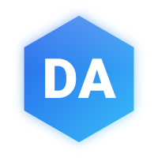
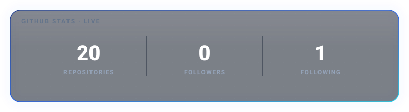
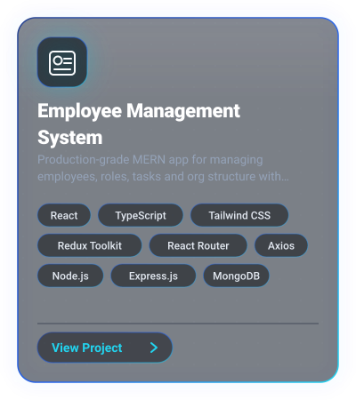
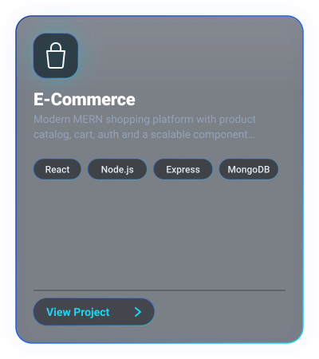
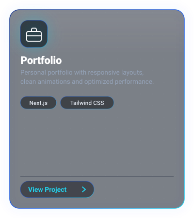
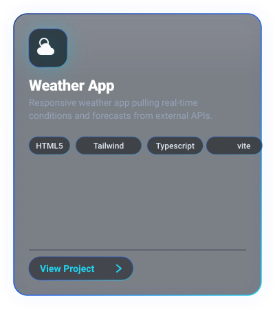
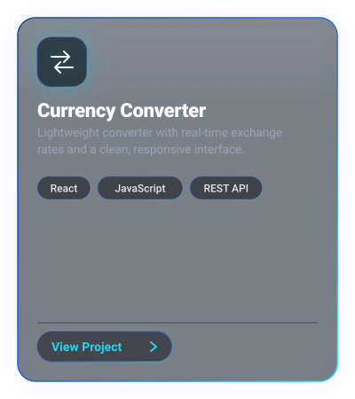

 

  

  

 

 

<h2>👋 About Me</h2>

I'm <strong>Daniyal Asif</strong>, a MERN Stack Developer from Pakistan currently working at <strong>5d Flow</strong>.

I enjoy building scalable, secure, and modern web applications using React, Node.js, Express, and MongoDB. My focus is writing clean, maintainable code while continuously improving my understanding of[...]

 

 

## 💻 Tech Stack

### Frontend

- React.js
- Next.js
- TypeScript
- JavaScript (ES6+)
- HTML5
- CSS3
- Tailwind CSS
- Redux Toolkit

### Backend

- Node.js
- Express.js
- REST APIs
- JWT Authentication

### Database

- MongoDB
- Mongoose

### Tools

- Git
- GitHub
- VS Code
- Postman
- npm

### Operating Systems

- Windows
- Linux

### Currently Learning

- System Design
- Scalable Backend Architecture
- Agentic AI
- Artificial Intelligence
- Performance Optimization

 

 

<h2>📊 GitHub Statistics</h2>

  

Automatically updated from GitHub.

 

 

<h2>🚀 Featured Projects</h2>

 

  

  

 

 

<h2>🤝 Let's Connect</h2>

I'm always interested in collaborating on meaningful projects, open-source contributions, and opportunities to build impactful software.

 

 

Designed with a custom SVG-first design system. 
Built from scratch without using README generator templates.

 
